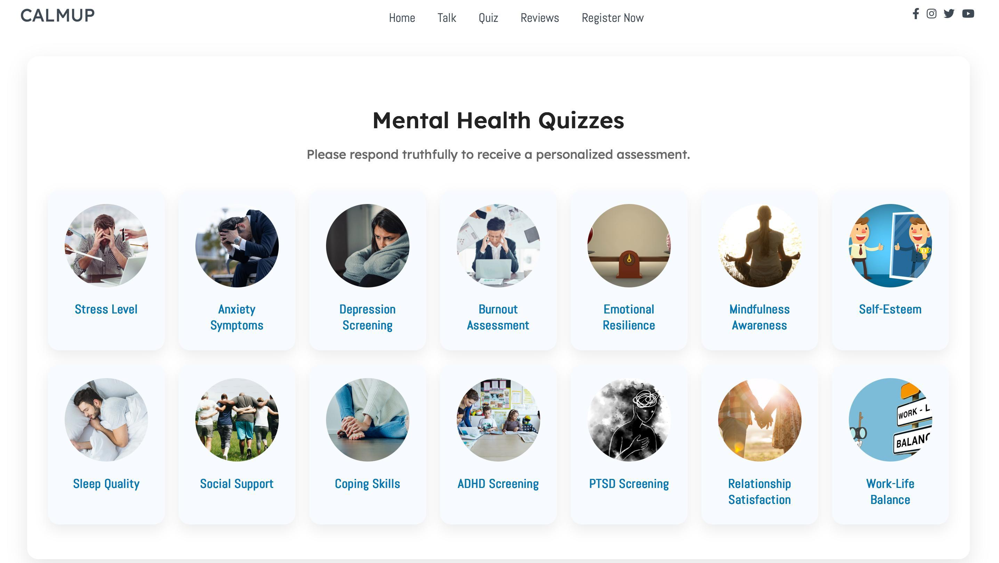
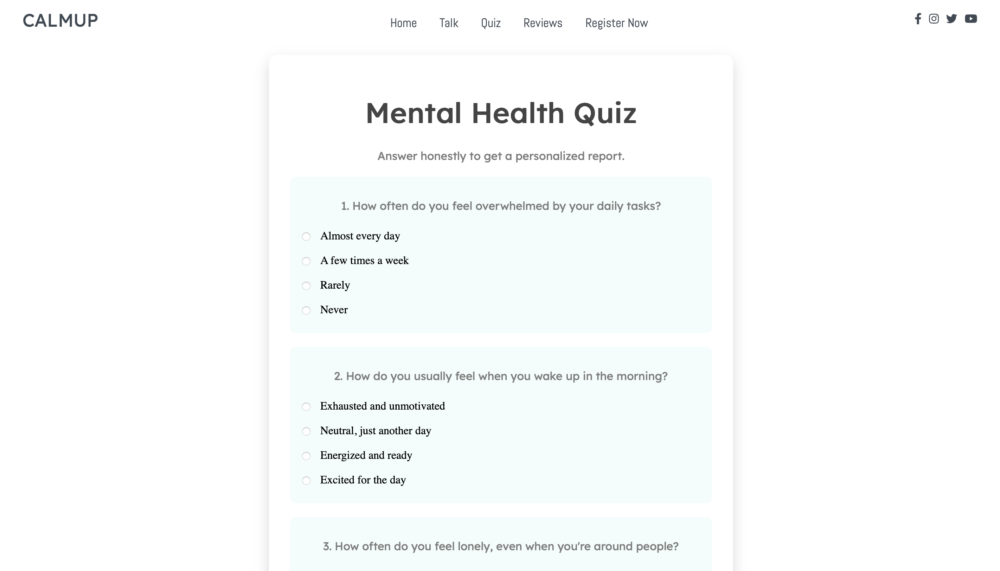
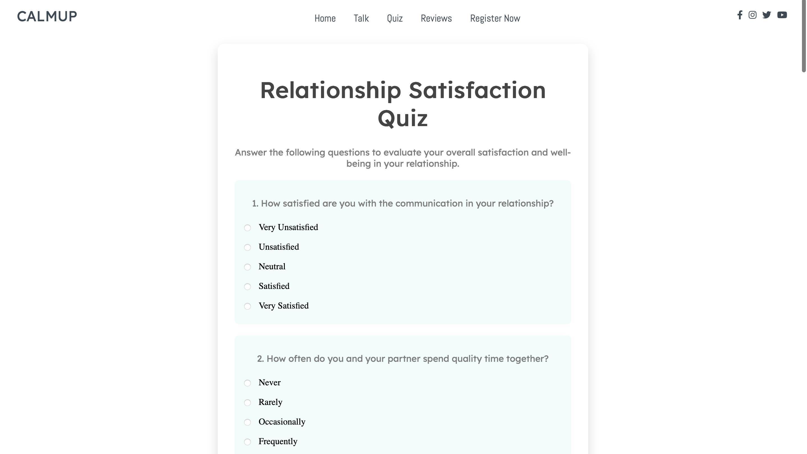
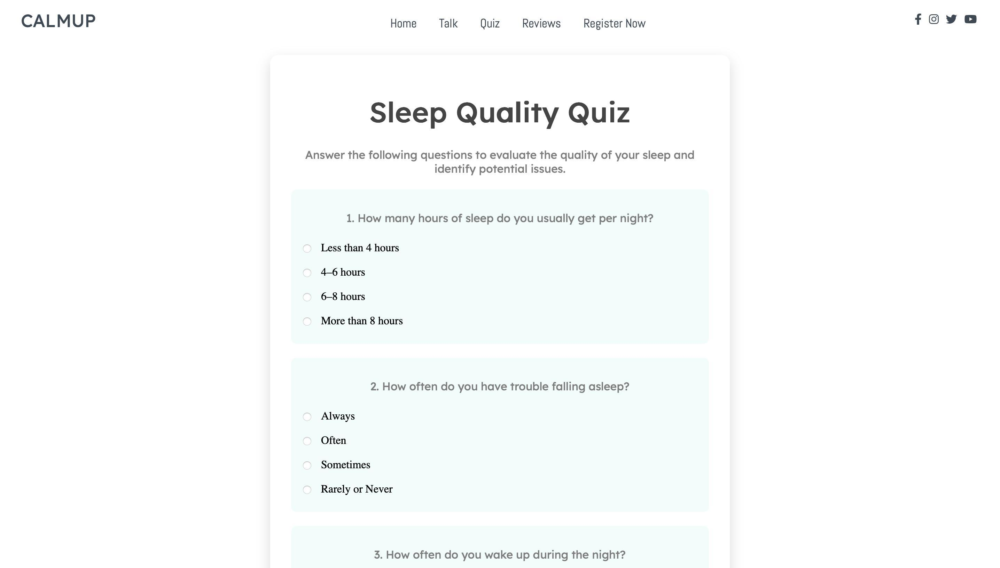
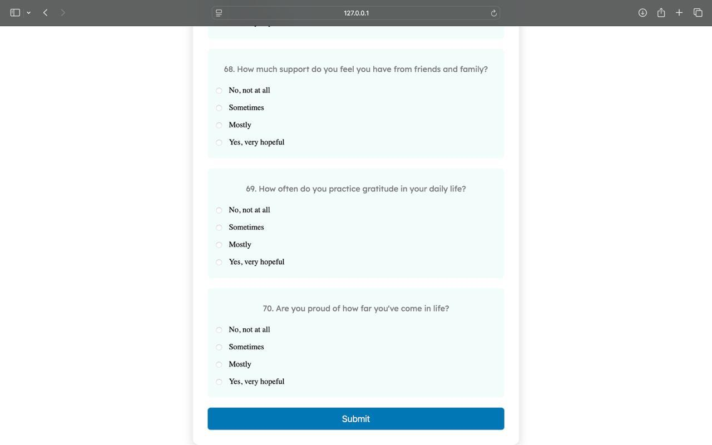
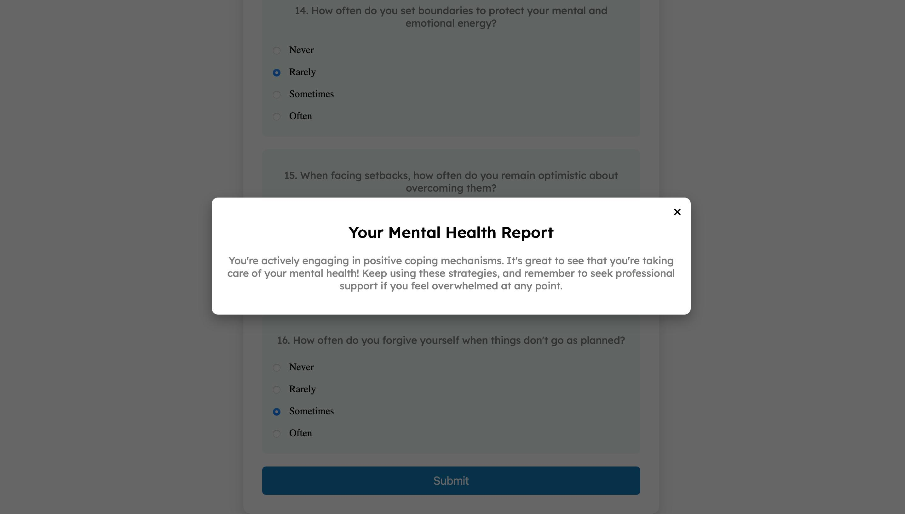
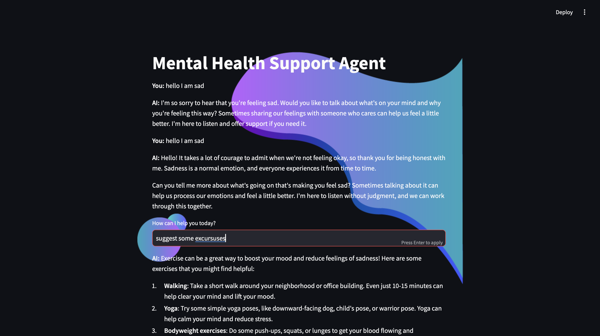
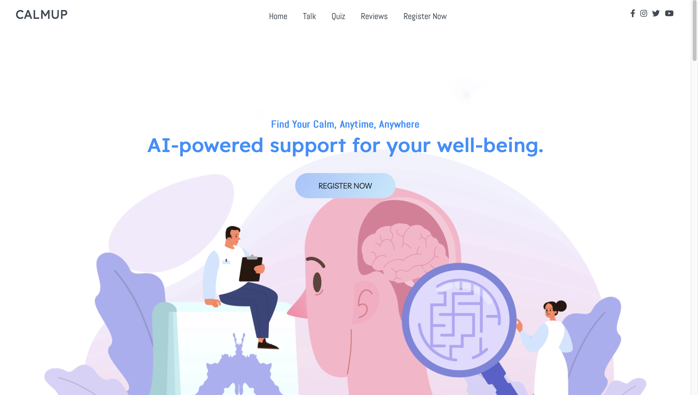

#  CalmUp – Mental Health Support Platform

CalmUp is a full-stack mental health web platform designed to help users understand, assess, and improve their mental well-being through structured diagnostic quizzes, AI-assisted interactions, and personalized mental health reports.

The platform focuses on **accessibility**, **user privacy**, and **clean UX**, offering multiple mental health assessments under one unified system.


##  Key Features

*  **12+ Mental Health Quizzes**
  Includes assessments for stress, anxiety, depression, PTSD, burnout, sleep quality, relationships, self-esteem, and more.

*  **AI-Assisted Chatbot**
  Interactive chatbot to guide users and support mental health conversations.

*  **Personalized Mental Health Reports**
  Generates meaningful feedback based on user responses.

*  **User Authentication**
  Secure registration and login system.

*  **Responsive UI**
  Optimized for desktop and modern browsers.


##  Tech Stack

### Frontend

* HTML
* CSS
* JavaScript

### Backend / Logic

* Python

### Tools & Platform

* Git & GitHub
* Visual Studio Code


##  Screenshots

### Mental Health Quizzes Dashboard



### Stress & Mental Health Quiz



### Relationship Satisfaction Quiz



### Sleep Quality Assessment



### Extended Questionnaire Flow



### Personalized Mental Health Report



### AI Chatbot Interaction



### User Dashboard




##  Project Structure

```
CalmUp-Mental-Health-Platform/
│── assets/
│── css/
│── fonts/
│── js/
│── screenshots/
│── webfonts/
│── Index.html
│── README.md
│── calmconnect.py
│── *.html (quiz & assessment pages)
```


##  Project Objective

To create a centralized and user-friendly mental health platform that:

* Encourages self-awareness
* Provides structured mental health assessments
* Delivers meaningful insights without overwhelming the user


##  Future Enhancements

* Advanced AI-driven emotional analysis
* Data visualization for progress tracking
* Backend database integration
* Cloud deployment


##  Contributers

**Made By Diya Kharb**


##  Disclaimer

This platform is intended for **educational and self-assessment purposes only** and does not replace professional mental health diagnosis or treatment.
